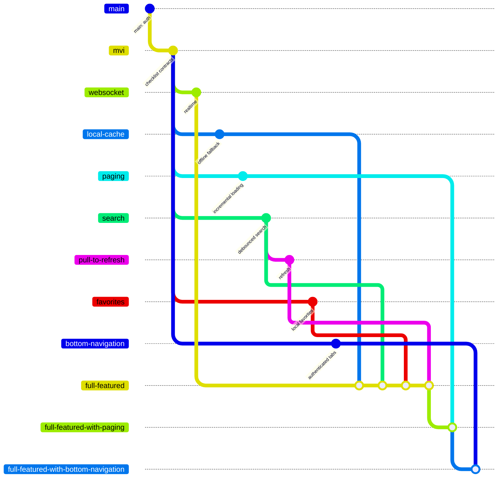

# Branching strategy

The repository is an experimentation graph. `main` establishes authentication.
`mvi` adds the shared checklist use case and becomes the base for isolated
examples. The full-featured branches merge those examples to expose integration
tradeoffs.

Isolated branches intentionally avoid depending on sibling branches. Each one
can be diffed against `mvi` to show only the concept under experimentation.
